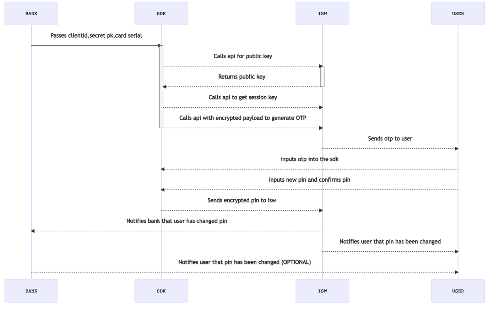

# PIN SELECT SDK

This sdk is meant to enable banks to change or create the customers card pins through a secure interface.

## Process Flow

This is the basic flow for all the functions


## Adding it to a project
```groovy
implementation 'com.github.interswitch-kenya-limited:pinonmobile:0.1.0'
```

Ensure that the jitpack io repository is part of your project by adding it to the root build.gradle in the allprojects => repositories section

### Configuring
Edit you app manifest file to add the following configuration metadata inside the application tag, the values given here are for test and you will need to change them once you are ready to go live.

```xml
 <meta-data
            android:name="interswitch-kenya-limited.pin_on_mobile.base_url"
            android:value="https://475e-41-215-3-130.ngrok.io/identity/api/v1/"/>
```
Finally ensure data binding is enabled in the root gradle file of your projects by adding the following config in its android section

```groovy
dataBinding {
    enabled = true
}
```

## Usage examples
```java
// create an institution class
Institution institution = new Institution(clientId
        ,clientSecret,institutionId,
        rsaPubKeyString,rsaPrivateKeyString,keyId);
// create an instance of the clients account
Account account = new Account(accountNumber,cardSerialNumber);

// The instance of an activity that will be active until the process is completed
PinOnMobile pinOnMobile = PinOnMobile.getInstance(MainActivity.this,institution,account);

// call the desired method

```

## Source code

Visit [the github repository](https://github.com/interswitch-kenya-limited/pin_on_mobile/tree/main/pinonmobile) to get the source code and releases of this project if you want to try a manual integration process that does not make use of gradle.